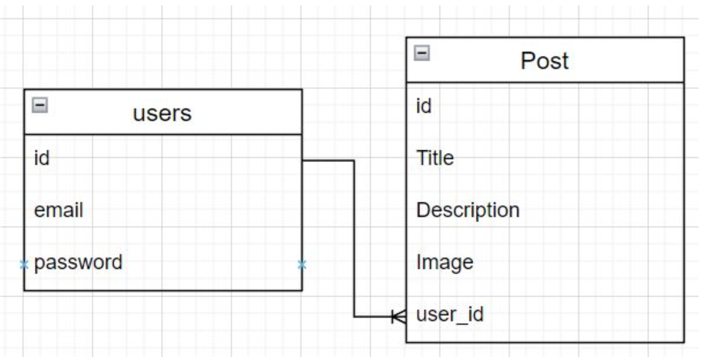

# README

## Pasos

### Creación del Blog

1. Crear un proyecto en rails con el nombre 'Blog', con postgresql

    ```bash
    rails new Blog -d postgresql
    ```

2. Crear la base de datos

    ```bash
    rails db:create
    ```

3. Identificar identidades

    

4. Agregar gema 'devise' al Gemfile y hacer bundle.

    ```ruby
    gem 'devise'
    ```

    ```bash
    bundle
    ```

5. Instalar devise

    ```bash
    rails g devise:install
    ```

6. Crear modelo 'User' con devise

    ```bash
    rails g devise User
    ```

7. Agregar bootstrap al proyecto mediante CDN en `application.html.erb`

8. Agregamos un partial de navbar en `application.html.erb`

    ```erb
    <%= render 'shared/navbar' %>
    ```

9. Agregamos un controlador de home

    ```bash
    rails g controller home index
    ```

10. Agregamos una ruta para el home en `routes.rb`

    ```ruby
    root 'home#index'
    ```

11. Configuramos initializers/devise.rb para usar turbo_stream

    ```ruby
    config.navigational_formats = ['*/*', :html, :turbo_stream]
    ```

12. Condicionales en navbar para mostrar inicio de sesión registro o nombre de usuario con sesión iniciada.

13. Creamos el modelo de Post con scaffold

    ```bash
    rails g scaffold Post image title description:text
    ```

14. Agregamos migración para referenciar posts con usuarios

    ```bash
    rails g migration AddUserToPosts user:references
    ```

15. Creamos un Post de ejemplo en Rails console

    ```ruby
    Post.create!(image:"https://img.freepik.com/foto-gratis/gato-rojo-o-blanco-i-estudio-blanco_155003-13189.jpg?w=2000", title: "En la mente de un gato", description: "Es un libro que explica de forma simple lo que realmente se sabe de los gatos y lo mucho que falta por entender. Es un libro que todo aquel que tenga o quiera tener un gato encontrará útil.", user_id: User.last.id)
    ```

16. Agregamos la restricción "before action" en el controlador de posts para que solo los usuarios registrados puedan ver los posts.

    ```ruby
    before_action :authenticate_user!
    ```

17. Relacionamos los modelos de User y Post

    ```ruby
    class User < ApplicationRecord
      has_many :posts
    end
    ```

    ```ruby
    class Post < ApplicationRecord
      belongs_to :user
    end
    ```

18. Editamos el post controller para que asocie el usuario con el post.

19. Editamos before action de post controller para permitir acceso a usuarios no registrados solo en index y show.

    ```ruby
    before_action :authenticate_user!, except: [:index, :show]
    ```

20. Editamos la vista show del post tal que solo el usuario que creó el post pueda editarlo o eliminarlo.

    ```erb
    <% if user_signed_in? && current_user.id == @post.user_id %>
      <div class="d-flex justify-content-between">
        <%= link_to 'Edit', edit_post_path(@post), class: "btn btn-primary" %>
        <%= link_to 'Destroy', @post, method: :delete, data: { confirm: 'Are you sure?' }, class: "btn btn-danger" %>
      </div>
    <% end %>
    ```

21. Al ingresar, el usuario es redirigido a la página de posts. Editando application_controller.rb

    ```ruby
    def after_sign_in_path_for(resource)
      posts_path
    end
    ```

22. Agregamos navegación adicional al navbar.

23. Agregamos algunos cambios al controlador de post para asociar el usuario con el post al crearlo y actualizarlo, mediante el método current_user. Además limitamos la edición.

    ```ruby
    @post = current_user.posts.build(post_params)
    ```

    ```ruby
    def edit
      unless current_user == @post.user
        redirect_to post_url(@post), notice: "You are not authorized to edit this post."
      end
    end
    ```

### Editando las vistas de Devise

Esta sección supone editar las vistas de devise, que hasta ahora están ocultas.

1. Importar vistas de devise.

    ```bash
        rails g devise:views
    ```

2. Agregamos migración: Nuevos campos para usuario.

    ```bash
    rails g migration AddDetailsToUsers phone name age 
    ```

3. Agregamos los campos phone, name y age a las vistas new y edit.

    ```erb
        <div class="field">
        <%= f.label :name %> <br>
        <%= f.text_field :name, autocomplete: "new-name" %>
        </div>
        <div class="field">
        <%= f.label :phone %> <br>
        <%= f.text_field :phone, autocomplete: "new-phone" %>
        </div>
        <div class="field">
        <%= f.label :age %> <br>
        <%= f.text_field :age, autocomplete: "new-age" %>
        </div>
    ```


